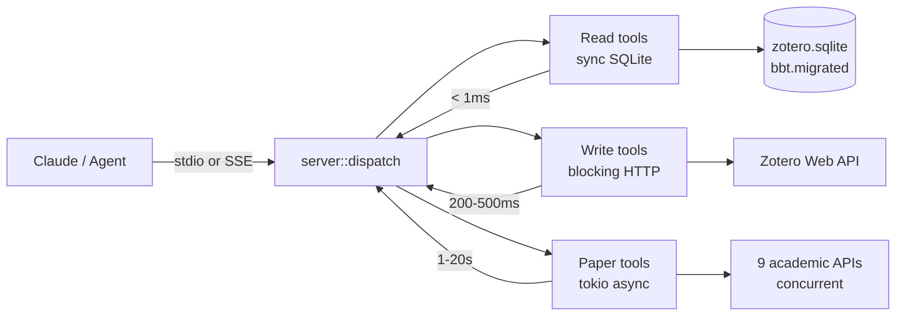
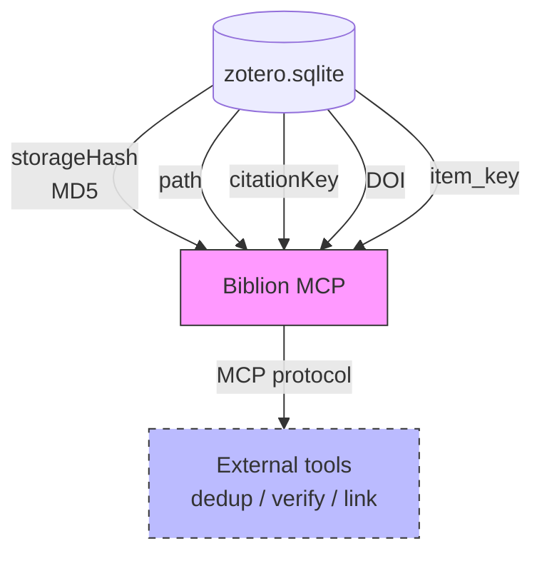

# Architecture

> *Academic knowledge made addressable.*

Biblion takes knowledge that exists (in Zotero's SQLite database) and makes it addressable — findable and retrievable by any process that speaks MCP or invokes the CLI.

## Crate structure

```
biblion/                          [workspace]
├── crates/
│   ├── paper-resolver/           [lib] 9-source PDF resolver
│   │   └── src/lib.rs            No Zotero dependency, publishable standalone
│   └── biblion/                  [bin] MCP server
│       └── src/
│           ├── main.rs           Entry point, transport selection, check subcommand
│           ├── config.rs         Config from env vars + optional TOML
│           ├── protocol.rs       MCP JSON-RPC types
│           ├── server.rs         stdio transport + shared dispatch
│           ├── sse.rs            SSE transport (axum)
│           ├── db/               SQLite readers (zotero.sqlite + bbt.migrated)
│           ├── api/              HTTP clients (BBT RPC, Zotero Web API)
│           └── tools/            25 MCP tool handlers
│               ├── read.rs       9 read tools (pure SQLite)
│               ├── write.rs      11 write tools (Zotero Web API)
│               ├── paper.rs      2 paper discovery tools
│               ├── bibtex.rs     Native BibTeX/BibLaTeX generation
│               ├── bibliography.rs  Native APA/IEEE formatting
│               └── format.rs     Item formatting, HTML→text, extract_year
```

## Data flow



1. Client sends JSON-RPC request via stdio pipe or SSE HTTP POST
2. `server::dispatch()` routes to the appropriate tool handler
3. Read tools query SQLite directly (sub-millisecond)
4. Write tools call the Zotero Web API via reqwest (~200-500ms)
5. Paper tools use paper-resolver with tokio for concurrent HTTP
6. Response is serialized and sent back via the same transport

## Content-identity primitives

Biblion exposes the raw data needed for content-addressing without
implementing content-addressing itself. External tools use these
primitives for deduplication, verification, and cross-system linking.



| Primitive | Source | Tool |
|-----------|--------|------|
| `storage_hash` (MD5) | `itemAttachments.storageHash` | `zotero_get_pdf_path`, `zotero_list_attachments` |
| `pdf_path` | `itemAttachments.path` (resolved) | `zotero_get_pdf_path` |
| `citekey` | `citationKey` field in EAV | all item tools |
| `doi` | `DOI` field in EAV | `zotero_get_item`, `zotero_search` |
| `item_key` | `items.key` (8-char) | all tools |

Biblion does NOT compute hashes, deduplicate files, or manage
cross-system identity. It reads what Zotero stored and exposes it
through a universal protocol (MCP) that any consumer can use.

## Agent auto-description


Agents receive instructions on MCP connection via the `instructions`
field in the `initialize` response. The content comes from
[`crates/biblion/MCP_INSTRUCTIONS.md`](../crates/biblion/MCP_INSTRUCTIONS.md), embedded into the
binary at compile time via `include_str!` in `server.rs`.

**When adding or changing tools, always update `crates/biblion/MCP_INSTRUCTIONS.md`.**
This is the single source of truth for what agents see. It is compiled
into the binary — no external file needed at runtime.

## How to add a new tool

1. **Add handler** in `tools/read.rs` (or `write.rs` / `paper.rs`):
   ```rust
   pub fn zotero_my_tool(args: &Value, ctx: &ServerContext) -> ToolCallResult {
       // ... implementation
       ToolCallResult::text("result".into())
   }
   ```

2. **Add to catalog** in `tools/mod.rs` (`tool_catalog()` function):
   ```rust
   tools.push(tool("zotero_my_tool", "Description.", json!({
       "type": "object",
       "properties": { "param": { "type": "string" } },
       "required": ["param"]
   })));
   ```

3. **Add to dispatch** in `tools/mod.rs` (`handle_tool_call()` function):
   ```rust
   "zotero_my_tool" => read::zotero_my_tool(args, ctx),
   ```

4. **Update `crates/biblion/MCP_INSTRUCTIONS.md`** — agents see this on connect.

## How to add a new PDF source

1. **Add async handler** in `crates/paper-resolver/src/lib.rs`:
   ```rust
   async fn try_my_source(client: &reqwest::Client, doi: Option<&str>, title: Option<&str>) -> Option<ResolvedPdf> {
       // Query the API, return ResolvedPdf if found
   }
   ```

2. **Add source name** to `SOURCE_NAMES` constant.

3. **Add to dispatch loop** in `resolve_pdf_async()`:
   ```rust
   "my_source" => futures.push(Box::pin(async move {
       try_my_source(c, doi, title).await.map(|r| (pri, r))
   })),
   ```

4. **Update `crates/biblion/MCP_INSTRUCTIONS.md`** if the source should be mentioned to agents.

The source will automatically be configurable via TOML and shown in `paper_source_status`.
